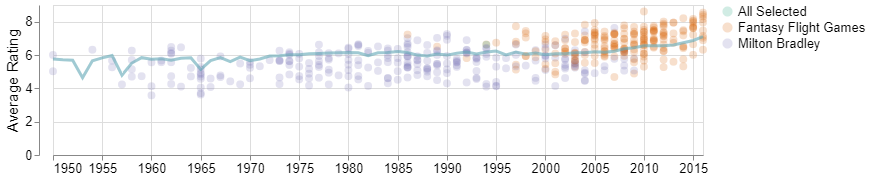
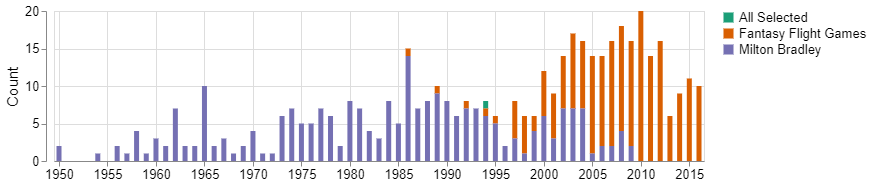

# Board Game Data Explorer

 

:game_die: **The Board Game Data Explorer can be found [here](https://boardgame-dashboard-data551.herokuapp.com/)!** :game_die:

This document (the README file) provides information about the data explorer. Jump straight to one of the sections below, or just scroll down to find out more.

* [Description](#description)
* [3D Game Explorer](#3d-game-explorer)
* [Data](#data)
* [Status](#status)
* [How to Contribute](#how-to-contribute)

## Description

The Board Game Data Explorer provides interactive exploration of board games from the [BoardGameGeek website](https://boardgamegeek.com/). 

The app allows exploration based on game name, categories, mechanics, publishers and provides user rating information.

Features include:

- Trends in board game features vs game published year.
- Top 10 games based user ratings and filtering on categories, mechanics, and/or publishers.
- :boom: A 3D game explorer. :boom:

The best way to understand the functionality is just to check-out the [app](https://boardgame-dashboard-data551.herokuapp.com/) but a few examples are shown below.

**Average User Ratings**

**Published Game Counts**

**3D Game Explorer**

## 3D Game Explorer

The 3D Game Explorer is a representation of game similarity based on game categories, mechanics, and user ratings. It allows a user to select a game and then explore similar games in close proximity.

A brief demo is shown above and a more detailed demo can be found [here](https://github.com/ubco-mds-2020-labs/dashboard-project-group14/blob/main/docs/demo/).

The 3D Game Explorer uses dimensionality reduction (t-SNE) which results in plotting similar games close to each other and less similar games farther away. The horizontal axes represent similarity in game categories and mechanics and the vertical axis represents similarity in user ratings (count of ratings and average ratings).

## Data

The Board Game Data Explorer queries the [BoardGameGeek](https://boardgamegeek.com/) API every two weeks to update the dataset. 

There is some filtering done on the dataset before it goes into the explorer including:

- Games with less than 50 user ratings are removed
- Games published before 1950 or with no published year are removed

## Status

v1.0.0 of the Board Game Data Explorer is now complete! The app was originally completed as part of the Master of Data Science program at the University of British Columbia (UBC) but will continue to be maintained.

There are still are few updates planned for the app that can be found [here](https://github.com/ubco-mds-2020-labs/dashboard-project-group14/issues/69) and include:

- Improve layout to scale better on different browsers
- Adding a few more data filters for the graphs

## Getting Help or Reporting an Issue

To report bugs/issues/feature requests, please file an
[issue](https://github.com/ubco-mds-2020-labs/dashboard-project-group14/issues).

These are very welcome!

## How to Contribute

If you would like to contribute, please see our
[CONTRIBUTING](https://github.com/ubco-mds-2020-labs/dashboard-project-group14/blob/main/CONTRIBUTING.md)
guidelines.

Please note that this project is released with a [Contributor Code of
Conduct](https://github.com/ubco-mds-2020-labs/dashboard-project-group14/blob/main/CODE_OF_CONDUCT.md).
By participating in this project you agree to abide by its terms.
