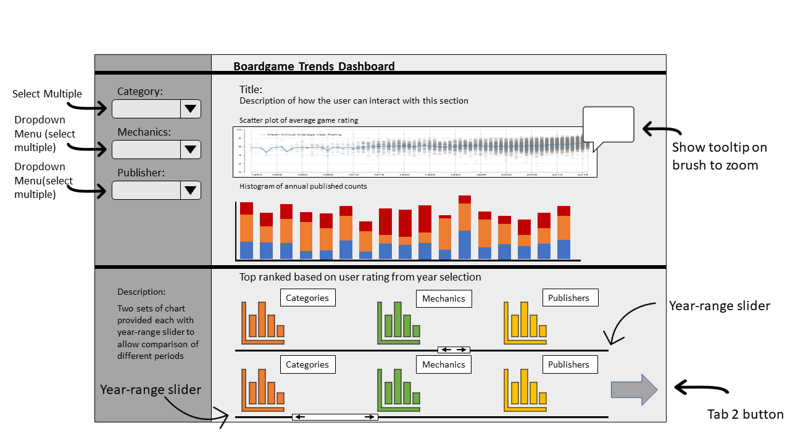
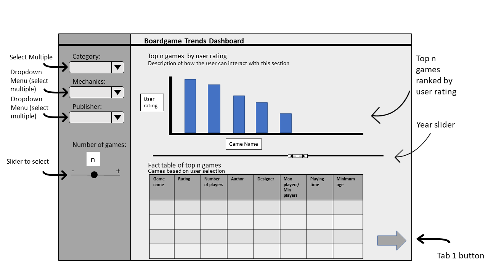

# Board Game Dashboard Proposal

**Team:** Nathan Smith, Mitch Harris, Ryan Koenig, Sophia Bulcock

## Motivation and Purpose

Our role: Data scientist consultancy firm

Target Audience: Board game designers and board game hobbyists

Board games are a popular and recently growing past time. Designing a popular board game can pay very well and be a personally rewarding career or hobby. To maximize profit and popularity, it is important to understand the trends seen in board games over time with the goal of designing games that people are interested in buying and playing. To address this, we are proposing to design a data visualization app that allows board game designers and board game hobbyists to visually explore a dataset from the [Board Game Geek website](https://boardgamegeek.com/). Users can use the app to identify trends in board games over a period from 1950 to 2021. Our app will show factors contributing to board game popularity and ratings, as well as investigate the trends seen over time with respect these factors. Users will be able to explore these trends by filtering by time period and and/or game category and can use this information to make decisions about what types of games and game factors contribute to a successful board game.

## Description of the Data

The proposed dashboard will visualize a dataset of approximately 10,000 boardgames published between 1950 and 2021. The dataset comes from the [Board Game Geek website](https://boardgamegeek.com/) and includes boardgames with descriptions, general game details, publisher, and user ratings. The dataset is available on [Kaggle](https://www.kaggle.com/mshepherd/board-games) and is regularly updated with the latest data.

Numerical game details include features such as min/max players and min/max/ave playing time, while categorical game details include features such as `category` and  `mechanic`. Note that the categorical features can have multiple values. For example, the `mechanic` feature for an individual board game may have both "Area Control" and "Area Influence" as values. The publishing information includes `year_published` and features for the `author`, `designer`, and `publisher`. The `publisher` feature is missing the least amount of values in the datasets compared with `author` and `designer`. The user rating features include the board game average user rating (`average_rating`) as well as the number of users that have provided a rating (`users_rated`).  There are currently no derived features anticipated for the dataset to support the dashboard.

## Research Questions and Usage Scenario

To get an idea of how one would use this dashboard, we can look at a scenario:

Sarah is a long time board game hobbyist and has always wanted to develop one on her own. One of her friends discovered the Board Game Dashboard and showed it to her. Looking through the dashboard, Sarah decided she now has the understanding of current trends in board game popularity to start her game development. Her primary interests are to try and find out why some board games are immensely popular and why some are not. She first set about looking at which category of game she should develop. She wanted to build a game where there was a high amount of interest but not a flooded market and found that recent "Trains and City Building" games generally received high reviews but there were not too many of them in the market. She also discovered that having a game that functioned with two to four players in this category was most typical. She was then able to filter the dataset by these features in order to see games that already exist and look at the features that made games in this category successful. For example, she was able to understand that successful games in the "Trains and City Building" category typically had more than three mechanics whereas less successful games had only one to three mechanics. Sarah now has a good idea of the parameters she wants to develop her game within.

## Description of App and Sketch

The app includes two tabs. The first tab allows the user to explore board game trends using game categories, mechanics and publishers. The upper section of this tab allows the user to select subsets of these features from dropdown menus. The selections will be presented on a histogram of annual published counts and will also be highlighted on a scatter plot of average game rating versus published year. The lower portion of the tab allows the user to select subsets of years using a slider and the top five to ten categories, mechanics, and publishers will be presented on bar charts.

The second tab allows the user to explore the most popular boardgames (based on average user rating) filtering on some or all of: categories, mechanics, publisher (using dropdown menus) and published year (using a slider). The user can also select the number of games they want shown using a slider. Features for each of these top selected games (such as min/max players, playing time, etc) will be shown in table format and the average user ratings will be shown on a bar chart.

An additional tab (not shown in the sketch below) that may be provided as part of the app, depending on the timeline, includes a two- or three-dimensional network plot showing clustering of similar board games. The potential network plot will likely be completed using a dimensionality reducing technique such as Principle Component Analysis or Manifold Learning. The plot would allow a user to highlight specific categories, mechanics, and publishers and see connections between similar games. An example of the potential network plot can be seen [here](https://medium.com/plotly/exploring-and-investigating-network-relationships-with-plotlys-dash-and-dash-cytoscape-ec625ef63c59).

*Figure 1: Board Game Dashboard Sketch (Tab 1)*

*Figure 2: Board Game Dashboard Sketch (Tab 2)*
